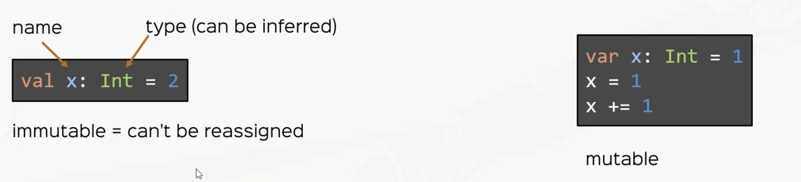
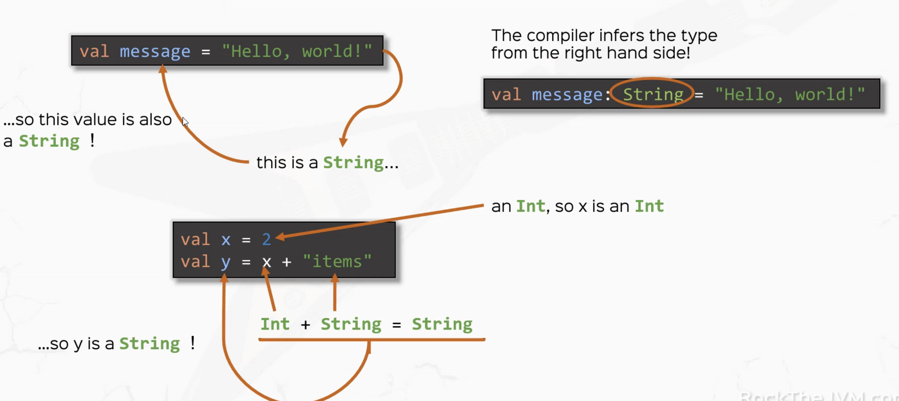
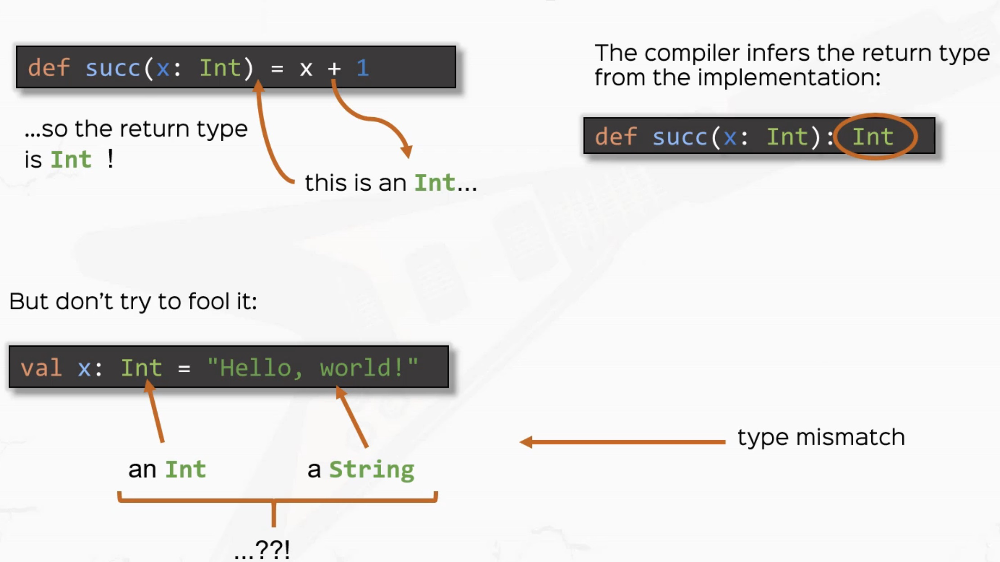
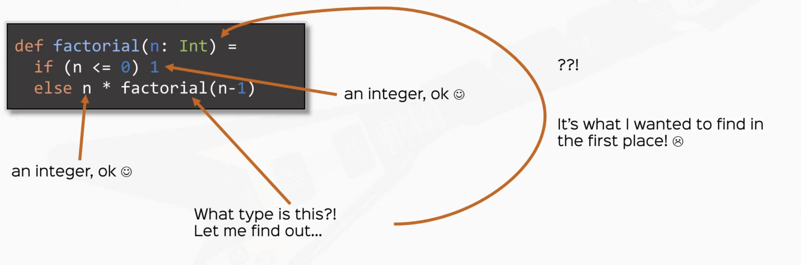
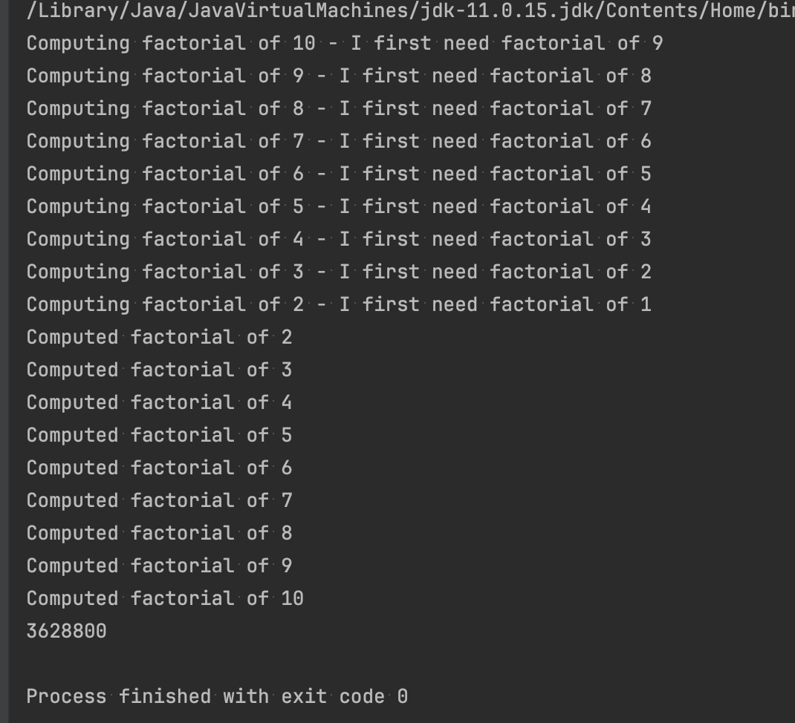

# scala_essential

- https://www.udemy.com/course/rock-the-jvm-scala-for-beginners/learn/lecture/10373000#overview
- https://rockthejvm.com/
- https://github.com/rockthejvm/udemy-scala-beginners

<br><br><br><br><br><br>

# 1. Scala Basics

## 1.1 Values, Variables and Types
1. Values `are immutable`

2. Variable `are mutable`

3. Types

4. Takeaways
    - prefer vals over vars
    - all vals and vars have types
    - compiler automatically infers types when omitted
    - learned how to use basic types
        - Boolean
        - Int, Long, Double
- 

```scala
package com.rick.scala
package lectures.part1basics

/**
 * @Author: Rick
 * @Date: 2024/6/9 18:02
 */
// "extends App" is equivalent to creating a main function, which makes this application runnable
object ValuesVariablesTypes extends App {
  val x: Int = 42
  println(x)

  // x = 2
  //  VALS ARE IMMUTABLE

  // COMPILER CAN INFER TYPE

  val aString: String = "it's rick!"
  val bString = "good afternoon"
  println(aString)
  println(bString)
  // SEMI COLON ; ARE ALLOWED BUT NOT SUGGESTED

  val aBoolean: Boolean = false
  val aChar: Char = 'a'
  val anInt: Int = x // -2**31 ~ 2**31-1 [4 bytes]
  val aShort: Short = 32767 // -2**15 ~ 2**15-1 [2 bytes]
  val aLong: Long = 1321891328085L // -2**63 ~ 2**63-1 [8 bytes]
  val aFloat: Float = 2.0f // [4 bytes]
  val aDouble: Double = 3.14 // [8 bytes]

  // variables
  var aVariable: Int = 4
  aVariable = 5 // side effects
}
```


<br><br><br>

## 1.2 Expressions
1. Basic expression: operators
```scala
val x = 3 + 5
val xIsEven = x % 2 == 0
val xIsOdd = !xIsEven
```

2. if in Scala is an expression
```scala
val cond: Boolean = 3 > 2
val i = if (cond) 42 else 0
```


3. code blocks in Scala are expressions
```scala
val x = {
    val cond: Boolean = 3 < 2
    if (cond) 42 else 0
}
```

4. Expressions vs Instructions
    - Instructions: do something, are executed(think Java)
    - Expression: give me the value of something, are evaluated(Scala)

5. `DO NOT USE while loops in your scala code`

<br><br><br>

## 1.3 Functions

1. function definition
```scala
    def function_name(parameter_name: parameter_type): return_type = {
        // function body
    }

```

<br><br><br>

## 1.4 Type Inference
1. what compiler know I
    - 

2. what compiler know II
    - 

3. need to specify return type
    - 

<br><br><br>

## 1.5 Stack & Tail Recursion
1. all stack frames JVM need to compute factorial
    - 


2. `StackOverflowError` if too many stack frame
```bash
Exception in thread "main" java.lang.StackOverflowError
	at java.base/java.nio.ByteBuffer.position(ByteBuffer.java:263)
```

3. scala use current stack frame to compute factorial `TAIL RECURSION`
```scala
  def anotherFactorial(n: BigInt): BigInt = {
    @tailrec // use this annotation
    def factHelper(x: BigInt, accumulator: BigInt): BigInt = {
      if (x <= 1) accumulator
      else factHelper(x - 1, x * accumulator) // allows scala to use current stack frame instead of creating a new one
                                              // TAIL RECURSION = use recursive call as the LAST expression
    }
    factHelper(n, 1)
  }
```

4. use `@tailrec` to check whether current function is tail recursion


<br><br><br>

# 1.6 call-by-name and call-by-value

1. call by value
    - value is computed before call
    - same value used everywhere

2. call by name
    - exprssion is passed literally
    - expression is evaluated at every use within

```scala
  private def infinite(): Int = 1 + infinite()

  private def printFirst(x: Int, y: => Int) = println(x)

  // stack over flow
  // printFirst(infinite(), 34) 

  // this is successful without crashing
  // second parameter is evaluate by name,
  // so infinite() wont get evaluate until pass into printFirst()
  // and its body only invoke println(x)
  // so infinite() will never get evaluated
  printFirst(34, infinite())
```