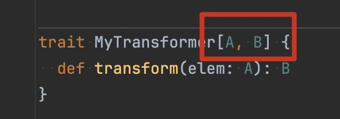
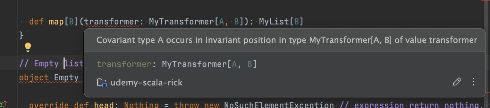
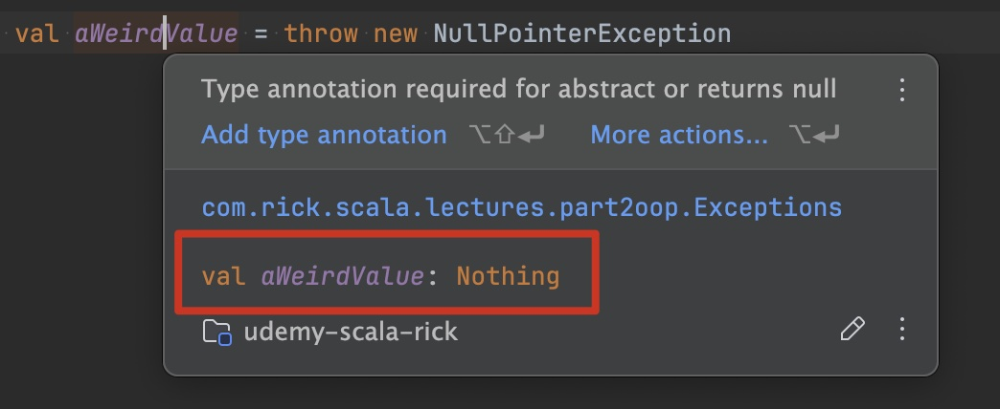
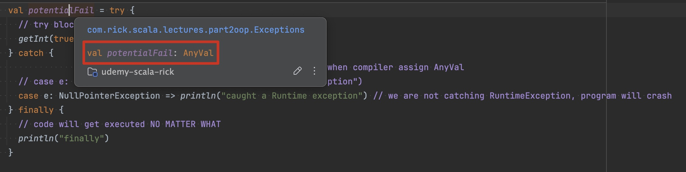
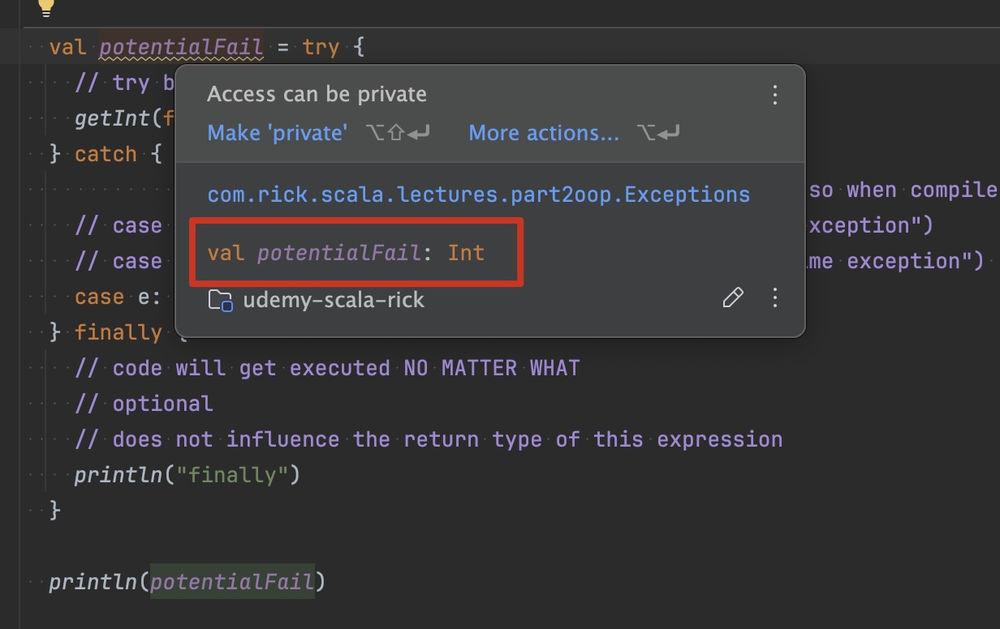
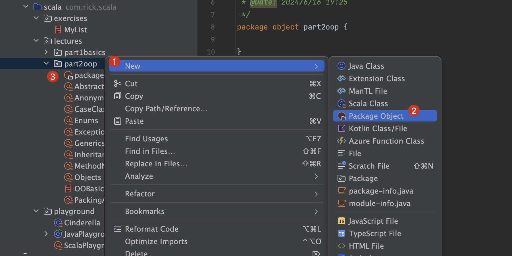
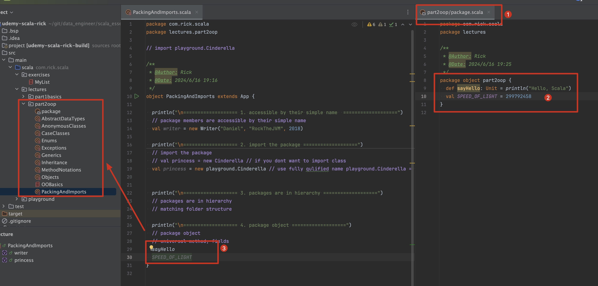
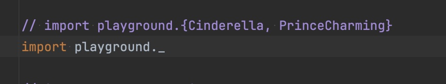
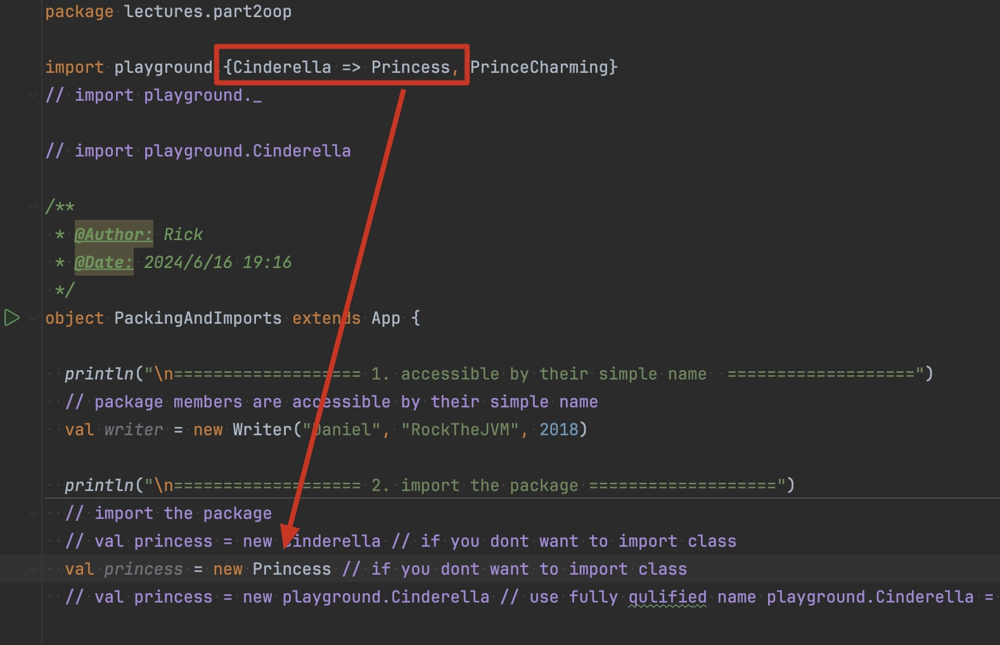
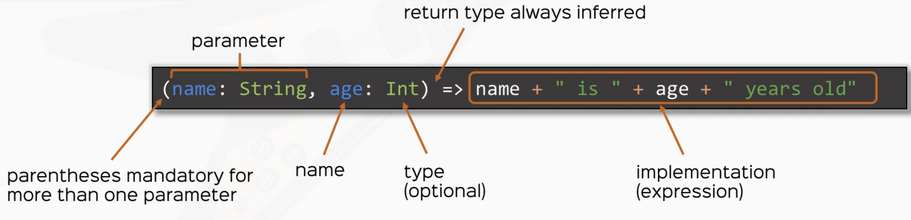

# scala_essential

- https://www.udemy.com/course/rock-the-jvm-scala-for-beginners/learn/lecture/10373000#overview
- https://rockthejvm.com/
- https://github.com/rockthejvm/udemy-scala-beginners

<br><br><br><br><br><br>

# 1. Scala Basics

## 1.1 Values, Variables and Types
1. Values `are immutable`

2. Variable `are mutable`

3. Types

4. Takeaways
    - prefer vals over vars
    - all vals and vars have types
    - compiler automatically infers types when omitted
    - learned how to use basic types
        - Boolean
        - Int, Long, Double
- 


```scala
package com.rick.scala
package lectures.part1basics

/**
 * @Author: Rick
 * @Date: 2024/6/9 18:02
 */
// "extends App" is equivalent to creating a main function, which makes this application runnable
object ValuesVariablesTypes extends App {
  val x: Int = 42
  println(x)

  // x = 2
  //  VALS ARE IMMUTABLE

  // COMPILER CAN INFER TYPE

  val aString: String = "it's rick!"
  val bString = "good afternoon"
  println(aString)
  println(bString)
  // SEMI COLON ; ARE ALLOWED BUT NOT SUGGESTED

  val aBoolean: Boolean = false
  val aChar: Char = 'a'
  val anInt: Int = x // -2**31 ~ 2**31-1 [4 bytes]
  val aShort: Short = 32767 // -2**15 ~ 2**15-1 [2 bytes]
  val aLong: Long = 1321891328085L // -2**63 ~ 2**63-1 [8 bytes]
  val aFloat: Float = 2.0f // [4 bytes]
  val aDouble: Double = 3.14 // [8 bytes]

  // variables
  var aVariable: Int = 4
  aVariable = 5 // side effects
}
```


<br><br><br>

## 1.2 Expressions
1. Basic expression: operators
```scala
val x = 3 + 5
val xIsEven = x % 2 == 0
val xIsOdd = !xIsEven
```

2. if in Scala is an expression
```scala
val cond: Boolean = 3 > 2
val i = if (cond) 42 else 0
```


3. code blocks in Scala are expressions
```scala
val x = {
    val cond: Boolean = 3 < 2
    if (cond) 42 else 0
}
```

4. Expressions vs Instructions
    - Instructions: do something, are executed(think Java)
    - Expression: give me the value of something, are evaluated(Scala)

5. `DO NOT USE while loops in your scala code`

<br><br><br>

## 1.3 Functions

1. function definition
```scala
    def function_name(parameter_name: parameter_type): return_type = {
        // function body
    }

```

<br><br><br>

## 1.4 Type Inference
1. what compiler know I
    - 

2. what compiler know II
    - 

3. need to specify return type
    - 

<br><br><br>

## 1.5 Stack & Tail Recursion
1. all stack frames JVM need to compute factorial
    - 
    


2. `StackOverflowError` if too many stack frame
```bash
Exception in thread "main" java.lang.StackOverflowError
	at java.base/java.nio.ByteBuffer.position(ByteBuffer.java:263)
```

3. scala use current stack frame to compute factorial `TAIL RECURSION`
```scala
  def anotherFactorial(n: BigInt): BigInt = {
    @tailrec // use this annotation
    def factHelper(x: BigInt, accumulator: BigInt): BigInt = {
      if (x <= 1) accumulator
      else factHelper(x - 1, x * accumulator) // allows scala to use current stack frame instead of creating a new one
                                              // TAIL RECURSION = use recursive call as the LAST expression
    }
    factHelper(n, 1)
  }
```

4. use `@tailrec` to check whether current function is tail recursion


<br><br><br>

## 1.6 call-by-name and call-by-value

1. call by value
    - value is computed before call
    - same value used everywhere

2. call by name
    - exprssion is passed literally
    - expression is evaluated at every use within

```scala
  private def infinite(): Int = 1 + infinite()

  private def printFirst(x: Int, y: => Int) = println(x)

  // stack over flow
  // printFirst(infinite(), 34) 

  // this is successful without crashing
  // second parameter is evaluate by name,
  // so infinite() wont get evaluate until pass into printFirst()
  // and its body only invoke println(x)
  // so infinite() will never get evaluated
  printFirst(34, infinite())
```

<br><br><br>

## 1.7 default and named arguments

1. when 99% of time we call a function with the same params
```scala
def factorial(x: Int, acc: Int = 1): Int= {
    ...
}
val fact10 = factorial(10)
```


2. naming parameters
```scala
def greet(name: String = "Superman", age: Int = 10): String =
  s"Hi, I'm $name and I'm $age years old."

greet(age = 5)
greet(name = "Sally", age = 5)
greet(age = 2, name = "dog")
```

<br><br><br>

## 1.8 Smart operations on Strings

1. String interpolates: F
    - for formatted strings, similar to printf
```scala
val speed = 1.2f
val name = "Daniel"
println(f"$name can eat $speed%2.2f burgers per minute")
```
- 

<br><br>

- can check for type correctness
```scala
val x = 1.1f
val str = f"$x%3d"
```
- 

<br><br><br><br><br><br>

# 2. Object-Oriented Programming in Scala

## 2.1 Object-Oriented Basics
1. defining class
```scala
class Person(name: String, age: Int)
```

2. instantiating
```scala
val bob = new Person("Bob", 22)
```

3. parameters vs fields
```scala
class Person(val name: String, age: Int)
```

4. defining methods
```scala
def greet(): String = {...}
```

5. calling methods
    - syntax allowed for parameter-less methods
```scala
val bobSaysHi = bob.greet
```

6. the keyword `this`

<br><br><br>

## 2.2 Syntactic Sugar: Method Notations
```scala
class Person(name: String) {
    def likes(movie: String): Boolean = {...}
    def unary_!(): String = {...}
    def isAlive(): Boolean = {...}
    def apply(greeting: String): String = {...}
}
```

1. infix notation
    - for methods with one parameter
```scala
    mary.likes("Inception")
    mary    likes   "Inception"
// object   method  parameter
```


2. prefix notation
    - only allowed `+ - ~ !`
```scala
mary.unary_!()
!mary
```

3. postfix notation
    - for methods with no parameters
```scala
mary.isAlive
mary isAlive
```


4. `apply()` is special
```scala
mary.apply("Hi there!")
mary("Hi there!")
```

<br><br><br>

## 2.3 Scala Objects
- Objects in Scala are dedicated concepts
- class level functionality, functionalities do not depend on instance of a class

- Scala doesn't have "static" values/ methods
1. Scala objects:
    - are in their own class
    - are the only instance
    - singleton pattern in one line
```scala
object Person {
    val N_EYES = 2
    def canFly: Boolean = false
}
```

2. Scala companions:
    - can access each other's private members
    - Scala is more OO than Java!
```scala
class Person
object Person
```

3. Scala applications
```scala
def main(args: Array[String]): Unit

object MyApp extends App
```

<br><br><br>

## 2.4 Inheritance, Abstract classes and Traits
1. Scala's Type Hierachy
    - 

2. Scala offers class-based inheritance
    - access modifier: `private`, `protected`, default(none=public)
    - need to pass in constructor arguments to parent class

```scala
class Animal
class Cat extends Animal
```

3. Derived classes can `override` members or methods

4. reuse parent fileds/ methods with `super`

5. Prevent inheritance with `final` and `sealed`

6. abstract classes

7. `traits`

8. inheriting from a class and multiple traits


<br><br><br>

## 2.5 Generics

1. use the same code on many(potentially unrelated) types
```scala
trait List[T] {
    def add(element: T)
}
```

2. generic method
```scala
object List {
    def single[A](element: A): List[A] = ???
}
```

3. multiple type parameters
```scala
trait Map[Key, Value] {
    ...
}
```


4. variance: if B extends A, should List[B] extend List[A]?
    - yes (covariant)               `trait List[+A]`
    - no (invariant) - default      `trait List[A]`
    - hell no! (contravariant)      `trait List[-A]`


5. Bounded types
```scala
class Car
class Supercar extends Car
class Garage[T <: Car](car: T)
```

6. an annoying variance problem

<br><br><br>

## 2.6 Anonmyous Classes
1. we can instantiate types and override fields or methods on the spot
```scala
trait Animal {
    def eat: Unit
}
val predator = new Animal {
    override def eat: Unit = println("RAWR!")
}
```

2. Rules
    - pass in required constructor arguments if needed
    - implement all abstract fields/ methods

3. works for traits and classes (abstract or not)

<br><br><br>

## 2.7 OO Exercise

- if we dont put [-A] in the trait, the compiler will complain
    - 
    - 
    

<br><br><br>

## 2.8 Case Classes
1. quick lightweight data structures with little boilerplate

2. companions already implemented

3. sensible equals, hashCode, toString

4. auto-promoted parameters to fields

5. Cloning

6. `case objects`

```scala
case class Person(name: String, age: Int)

val bob = Person("Bob", 26)

bob.name
```


<br><br><br>

## 2.8 Scala 3: Enums

1. Enums is a data type you can define as class
```scala
object Enums {

  enum Permissions {
    case READ, WRITE, EXECUTE, NONE

    // add fields/ methods
    def openDocument(): Unit =
      if (this == READ) println("opening document...")
      else println("reading not allowed.")
  }

  val somPermissions: Permissions = Permissions.READ

  // constructor args
  // define constant inside Enum
  enum PermissionsWithBits(bits: Int) {
    case READ extends PermissionsWithBits(4) // 100
    case WRITE extends PermissionsWithBits(2) // 010
    case EXECUTE extends PermissionsWithBits(1) // 001
    case NONE extends PermissionsWithBits(0) // 000
  }

  object PermissionsWithBits {
    def fromBit(bits: Int): PermissionsWithBits = // whatever
      PermissionsWithBits.NONE
  }

  // standard API
  // defined by the order
  val somePermissionsOrdinal = somPermissions.ordinal
  val allPermissions = PermissionsWithBits.values // array of all possible values of the enum
  val readPermission: Permissions = Permissions.valueOf("READ")
  /*
    In Java
    enum Thing {
      A(2),
      B(3)
    }
   */

  // type 'main' it will be auto generated
  def main(args: Array[String]): Unit = {
    somPermissions.openDocument()
    println(somePermissionsOrdinal)
    println(allPermissions.toList)
    println(readPermission.toString)
  }
}

```

<br><br><br>

## 2.9 Exceptions
1. a weird value is nothing, which meaning can hold a value
    - 

2. try...catch...finally
    - if try catch return differnt type
        - 
    - if try catch return same type
        - 
        

3. Exceptions crash your program

4. how to throw exceptions
    - throwing returns nothing

5. how to catch exceptions

6. define custom exceptions
```scala
val someValue = throw new RuntimeException

try {
  // compute a value
} catch {
  case e: RuntimeException => /* another value */
} finally {
  // block for side effects
}

class MyKnife extends Exception
```

<br><br><br>

## 2.10 Packaging and Imports
1. package object `only 1 per package`
    - 

2. this make the package object method, fields visible to entire package
    - 

3. imports
    - `_` for all 
        - 
    - use `alias` for imports
        - 

4. package = a group of definitions under the same name

5. to use a definition
    - be in the same package
    - or import the package

6. Best practice - mirror the file structure

7. fully qualified name

8. `package objects` hold standalone methods/ constants
    - one per packge

9. Name aliasing at imports
```scala
// Person.scala
package com.rick.scala.oop

class Person
object Person


import java.sql.{Date => SqlDate}
import java.util.{Date => JavaDate}
import java.{util => ju}
```

<br><br><br><br><br><br>

# 3. Functional Programming in Scala

## 3.1 What's a Function, Really?
1. we want to work with functions
    - pass functions as parameters
    - use functions as values

2. Problem: Scala works on top of the JVM
    - designed for JAVA
    - first-class elements: objects (instances of classes)

3. Solution: All Scala functions are objects!
    - function traits, up to 22 params
    - syntactic sugar function types
```scala
trait Function1[-A, +B] {
    def apply(element: A): B
}

Function2[Int, String, Int]
(Int, String) => Int
```

<br><br><br>

## 3.2 Anonymous Functions
1. Instead of passing anonymous FunctionX instances every time
    - cumbersome
    - still object-oriented
```scala
(x, y) => x + y // lambda

(name: String, age: Int) => name + " is " + age + " year old"
```


2. Further sugar
```scala
val add: (Int, Int) => Int = _ + _
```

<br><br><br>

## 3.3 Higher-Order-Functions and Curries
1. Functional programming: working with functions
    - pass functions as parameters
    - return functions as results
    - => Higher Order Functions (HOFs)
```scala
def nTimesBetter(f: Int => Int, n: Int): Int => Int = ...
```

2. Currying = functions with multiple paramter lists
```scala
                    // param list 1
def curriedFormatter(a: Int, b: Int)(c: String): String
                                    // param list 2
```

<br><br><br>

## 3.4 map, flatMap, filter and for-comprehensions
```scala
  println("\n======================== map ========================")
  // map
  println(list.map(_ + 1))
  println(list.map(_ + " is a number"))


  println("\n======================== filter ========================")
  // filter
  // based on predicate function to filter element
  println(list.filter(_ % 2 == 0))

  println("\n======================== flat map ========================")
  val toPair = (x: Int) => List(x, x + 1)
  println(list.flatMap(toPair))


  println("\n======================== for-comprehensions - 1 ========================")
  val forCombinations = for {
    n <- numbers if n % 2 == 0
    c <- chars
    color <- colors
  } yield s"$c$n-$color"
  println(forCombinations)

  println("\n======================== for-comprehensions - 2 ========================")
  for {
    n <- numbers
  } println(n)
```

