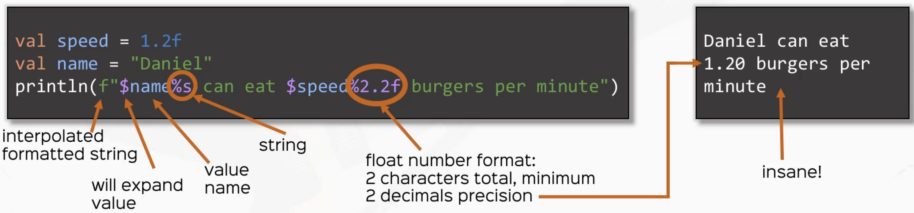
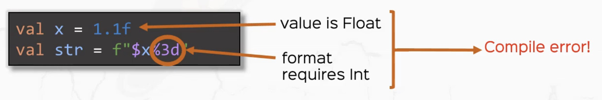
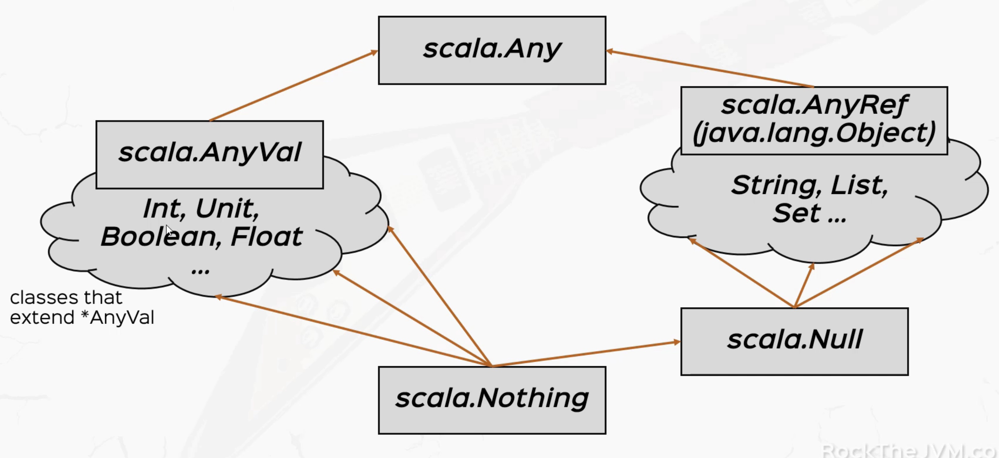

# scala_essential

- https://www.udemy.com/course/rock-the-jvm-scala-for-beginners/learn/lecture/10373000#overview
- https://rockthejvm.com/
- https://github.com/rockthejvm/udemy-scala-beginners

<br><br><br><br><br><br>

# 1. Scala Basics

## 1.1 Values, Variables and Types
1. Values `are immutable`

2. Variable `are mutable`

3. Types

4. Takeaways
    - prefer vals over vars
    - all vals and vars have types
    - compiler automatically infers types when omitted
    - learned how to use basic types
        - Boolean
        - Int, Long, Double
- 


```scala
package com.rick.scala
package lectures.part1basics

/**
 * @Author: Rick
 * @Date: 2024/6/9 18:02
 */
// "extends App" is equivalent to creating a main function, which makes this application runnable
object ValuesVariablesTypes extends App {
  val x: Int = 42
  println(x)

  // x = 2
  //  VALS ARE IMMUTABLE

  // COMPILER CAN INFER TYPE

  val aString: String = "it's rick!"
  val bString = "good afternoon"
  println(aString)
  println(bString)
  // SEMI COLON ; ARE ALLOWED BUT NOT SUGGESTED

  val aBoolean: Boolean = false
  val aChar: Char = 'a'
  val anInt: Int = x // -2**31 ~ 2**31-1 [4 bytes]
  val aShort: Short = 32767 // -2**15 ~ 2**15-1 [2 bytes]
  val aLong: Long = 1321891328085L // -2**63 ~ 2**63-1 [8 bytes]
  val aFloat: Float = 2.0f // [4 bytes]
  val aDouble: Double = 3.14 // [8 bytes]

  // variables
  var aVariable: Int = 4
  aVariable = 5 // side effects
}
```


<br><br><br>

## 1.2 Expressions
1. Basic expression: operators
```scala
val x = 3 + 5
val xIsEven = x % 2 == 0
val xIsOdd = !xIsEven
```

2. if in Scala is an expression
```scala
val cond: Boolean = 3 > 2
val i = if (cond) 42 else 0
```


3. code blocks in Scala are expressions
```scala
val x = {
    val cond: Boolean = 3 < 2
    if (cond) 42 else 0
}
```

4. Expressions vs Instructions
    - Instructions: do something, are executed(think Java)
    - Expression: give me the value of something, are evaluated(Scala)

5. `DO NOT USE while loops in your scala code`

<br><br><br>

## 1.3 Functions

1. function definition
```scala
    def function_name(parameter_name: parameter_type): return_type = {
        // function body
    }

```

<br><br><br>

## 1.4 Type Inference
1. what compiler know I
    - 

2. what compiler know II
    - 

3. need to specify return type
    - 

<br><br><br>

## 1.5 Stack & Tail Recursion
1. all stack frames JVM need to compute factorial
    - 
    


2. `StackOverflowError` if too many stack frame
```bash
Exception in thread "main" java.lang.StackOverflowError
	at java.base/java.nio.ByteBuffer.position(ByteBuffer.java:263)
```

3. scala use current stack frame to compute factorial `TAIL RECURSION`
```scala
  def anotherFactorial(n: BigInt): BigInt = {
    @tailrec // use this annotation
    def factHelper(x: BigInt, accumulator: BigInt): BigInt = {
      if (x <= 1) accumulator
      else factHelper(x - 1, x * accumulator) // allows scala to use current stack frame instead of creating a new one
                                              // TAIL RECURSION = use recursive call as the LAST expression
    }
    factHelper(n, 1)
  }
```

4. use `@tailrec` to check whether current function is tail recursion


<br><br><br>

## 1.6 call-by-name and call-by-value

1. call by value
    - value is computed before call
    - same value used everywhere

2. call by name
    - exprssion is passed literally
    - expression is evaluated at every use within

```scala
  private def infinite(): Int = 1 + infinite()

  private def printFirst(x: Int, y: => Int) = println(x)

  // stack over flow
  // printFirst(infinite(), 34) 

  // this is successful without crashing
  // second parameter is evaluate by name,
  // so infinite() wont get evaluate until pass into printFirst()
  // and its body only invoke println(x)
  // so infinite() will never get evaluated
  printFirst(34, infinite())
```

<br><br><br>

## 1.7 default and named arguments

1. when 99% of time we call a function with the same params
```scala
def factorial(x: Int, acc: Int = 1): Int= {
    ...
}
val fact10 = factorial(10)
```


2. naming parameters
```scala
def greet(name: String = "Superman", age: Int = 10): String =
  s"Hi, I'm $name and I'm $age years old."

greet(age = 5)
greet(name = "Sally", age = 5)
greet(age = 2, name = "dog")
```

<br><br><br>

## 1.8 Smart operations on Strings

1. String interpolates: F
    - for formatted strings, similar to printf
```scala
val speed = 1.2f
val name = "Daniel"
println(f"$name can eat $speed%2.2f burgers per minute")
```
- 

<br><br>

- can check for type correctness
```scala
val x = 1.1f
val str = f"$x%3d"
```
- 

<br><br><br><br><br><br>

# 2. Object-Oriented Programming in Scala

## 2.1 Object-Oriented Basics
1. defining class
```scala
class Person(name: String, age: Int)
```

2. instantiating
```scala
val bob = new Person("Bob", 22)
```

3. parameters vs fields
```scala
class Person(val name: String, age: Int)
```

4. defining methods
```scala
def greet(): String = {...}
```

5. calling methods
    - syntax allowed for parameter-less methods
```scala
val bobSaysHi = bob.greet
```

6. the keyword `this`

<br><br><br>

## 2.2 Syntactic Sugar: Method Notations
```scala
class Person(name: String) {
    def likes(movie: String): Boolean = {...}
    def unary_!(): String = {...}
    def isAlive(): Boolean = {...}
    def apply(greeting: String): String = {...}
}
```

1. infix notation
    - for methods with one parameter
```scala
    mary.likes("Inception")
    mary    likes   "Inception"
// object   method  parameter
```


2. prefix notation
    - only allowed `+ - ~ !`
```scala
mary.unary_!()
!mary
```

3. postfix notation
    - for methods with no parameters
```scala
mary.isAlive
mary isAlive
```


4. `apply()` is special
```scala
mary.apply("Hi there!")
mary("Hi there!")
```

<br><br><br>

## 2.3 Scala Objects
- Objects in Scala are dedicated concepts
- class level functionality, functionalities do not depend on instance of a class

- Scala doesn't have "static" values/ methods
1. Scala objects:
    - are in their own class
    - are the only instance
    - singleton pattern in one line
```scala
object Person {
    val N_EYES = 2
    def canFly: Boolean = false
}
```

2. Scala companions:
    - can access each other's private members
    - Scala is more OO than Java!
```scala
class Person
object Person
```

3. Scala applications
```scala
def main(args: Array[String]): Unit

object MyApp extends App
```

<br><br><br>

## 2.4 Inheritance, Abstract classes and Traits
1. Scala's Type Hierachy
    - 

2. Scala offers class-based inheritance
    - access modifier: `private`, `protected`, default(none=public)
    - need to pass in constructor arguments to parent class

```scala
class Animal
class Cat extends Animal
```

3. Derived classes can `override` members or methods

4. reuse parent fileds/ methods with `super`

5. Prevent inheritance with `final` and `sealed`

6. abstract classes

7. `traits`

8. inheriting from a class and multiple traits